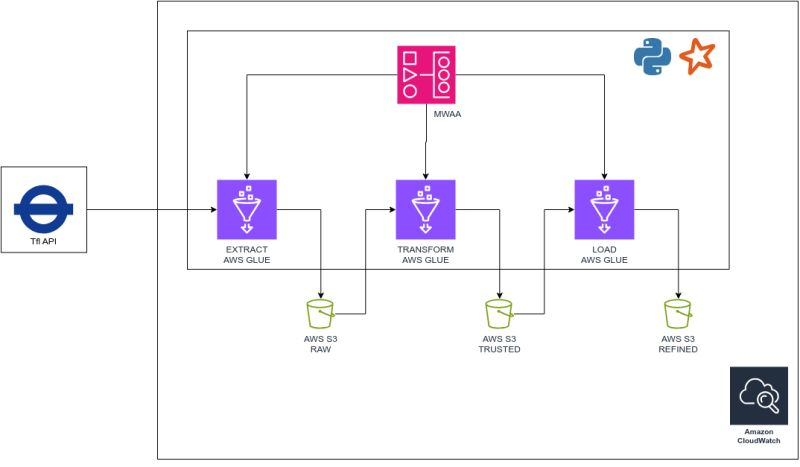

# 🚇 Pipeline de Dados — Transport for London (TfL)

## 📌 Sobre o Projeto

Este projeto implementa um **pipeline de dados end-to-end** para ingestão, processamento e análise de dados públicos do sistema de transporte de Londres (*Transport for London — TfL*).

A solução foi projetada com foco em:
- **Escalabilidade**
- **Automação**
- **Boas práticas de Engenharia de Dados**

O pipeline passou por uma evolução importante: iniciou em ambiente local e foi migrado para uma arquitetura **100% em cloud (AWS)**, simulando um cenário real de produção.

---

## 🏗️ Arquitetura

A arquitetura utiliza serviços gerenciados da AWS para garantir robustez e baixa manutenção operacional:
```
Airflow (MWAA)
↓
AWS Glue (ETL)
↓
Amazon S3 (Data Lake)
↓
Amazon Athena (Query / Analytics)
↓
CloudWatch (Logs & Monitoramento)
```


### 🔧 Componentes

- **Apache Airflow (MWAA)** → Orquestração e agendamento do pipeline  
- **AWS Glue** → Processamento distribuído e ETL  
- **Amazon S3** → Data Lake (dados brutos e tratados)  
- **Amazon Athena** → Consultas SQL serverless  
- **CloudWatch** → Monitoramento e observabilidade  
- **IAM Roles** → Controle de acesso com *least privilege*  

---

## 🔄 Fluxo do Pipeline

1. A DAG é acionada automaticamente via Airflow (MWAA)  
2. O Airflow dispara um job no AWS Glue  
3. O Glue realiza ingestão de dados via API do TfL  
4. Os dados são transformados e estruturados  
5. Os dados são armazenados no Amazon S3 (camadas do Data Lake)  
6. Os dados ficam disponíveis para consulta via Athena  


---

## 🚀 Stack Tecnológica

- **Python**
- **Apache Airflow (MWAA)**
- **AWS Glue**
- **Amazon S3**
- **Amazon Athena**
- **AWS IAM**
- **Docker (ambiente local)**
- **Apache Spark (versão inicial)**

---

## 🧠 Evolução da Arquitetura

### 🔹 Versão 1 — Ambiente Local
- Airflow com Docker  
- Processamento com Apache Spark  
- Simulação completa do pipeline  

### 🔹 Versão 2 — Cloud (Atual)
- Orquestração com **Amazon MWAA**  
- Processamento com **AWS Glue (serverless)**  
- Armazenamento em **Amazon S3**  
- Arquitetura **escalável e pronta para produção**  

> O ambiente local foi mantido no repositório como referência de desenvolvimento e validação.

---

## ⚙️ Como Executar

### ☁️ Ambiente Cloud (Principal)

#### Pré-requisitos:
- Conta AWS configurada  
- Bucket S3 criado  
- Job no AWS Glue configurado  
- Ambiente MWAA ativo  

#### Passos:
1. Subir a DAG no bucket do MWAA  
2. Garantir que o Glue Job (`tfl-main`) está criado  
3. Executar a DAG via interface do Airflow  

---

## 🔐 Segurança

- Uso de **IAM Roles** para controle de acesso  
- Aplicação do princípio de **menor privilégio (Least Privilege)**  
- Separação clara de responsabilidades entre serviços  

---

## 💡 Diferenciais

✔ Pipeline completo (end-to-end)  
✔ Arquitetura evolutiva (local → cloud)  
✔ Uso de serviços **serverless da AWS**  
✔ Orquestração real com Airflow (MWAA)  
✔ Processamento distribuído com Glue  
✔ Estrutura pronta para escalar em produção  
✔ Boas práticas de Engenharia de Dados  

---

## 📁 Estrutura do Projeto

```
tfl/
├── dags/ # DAGs do Airflow (MWAA)
├── src/ # Código ETL
├── docker/ # Ambiente local (referência)
│ ├── docker-compose.yaml
│ └── Dockerfile
├── config/ # Configurações
├── requirements.txt
├── README.md
```

